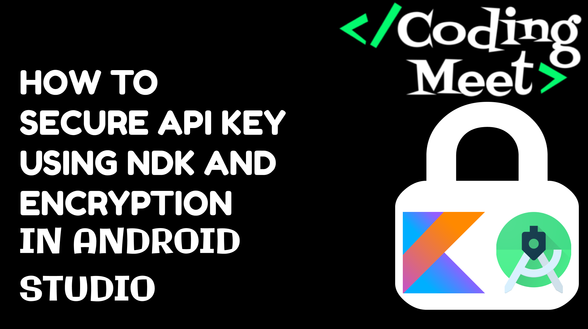

# Secure API Key or Text Using NDK and Themis Encryption in Android Studio Kotlin

Welcome to our tutorial on fortifying your Android app's security through advanced techniques! In this video, we delve into the world of Android NDK and Themis encryption to safeguard your API keys. Our step-by-step guide will empower you to implement rock-solid security practices, protecting sensitive data within your applications.

## 🚀 What You'll Learn

- Leveraging the Android NDK for enhanced security in Android development.
- Integrating Themis encryption to secure API keys and text.
- Step-by-step guide on combining NDK, Themis, Kotlin, and Android Studio.
- Implementing advanced security practices for robust protection.

## [📹 Watch the Tutorial](https://youtu.be/b1Q1eAubrMg?si=4yamkbGrvwfRuJ53)

## Support the Project

If you find this tutorial series helpful and would like to support the development of more content, consider buying me a coffee! Your support helps in creating high-quality tutorials.

Your generosity is greatly appreciated! Thank you for supporting this project.

Happy coding! 🚀✨
